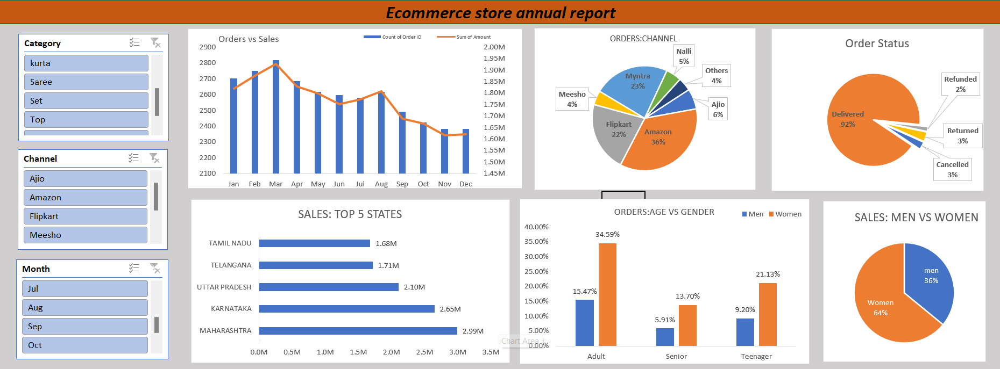

# Annual Sales Report Dashboard

## Overview
This project features an Excel-based dashboard designed to analyze and visualize the annual sales performance of a store. It provides insights into sales trends, customer demographics, and product performance through interactive slicers and visuals.

---

## What’s Included
- **Interactive Filters**: Slicers for Category, Sales Channel, and Month to dynamically explore data.
- **Visualizations**:
  - Top 5 States by sales.
  - Age vs Gender distribution.
  - Men vs Women sales comparison.
  - Orders vs Sales analysis.
  - Pie charts for Channel contribution and Order Status distribution.

### **Main Dashboard Overview**

---

## Usage
1. Open the dashboard to view overall insights.
2. Use slicers to filter and analyze specific metrics.
3. Explore charts and graphs for detailed performance insights.
4. Export or save filtered views as needed.

---

## Data
- Includes fields such as Date, Category, Channel, State, Age, Gender, Order Status, and Revenue.
- Visualizations are powered by summarized metrics like total sales, customer demographics, and channel performance.

---

## Customization
Update the dataset in the `Data` sheet or modify the visuals and slicers to meet new requirements.

---

## License
This project is free to use and modify under the MIT License.
